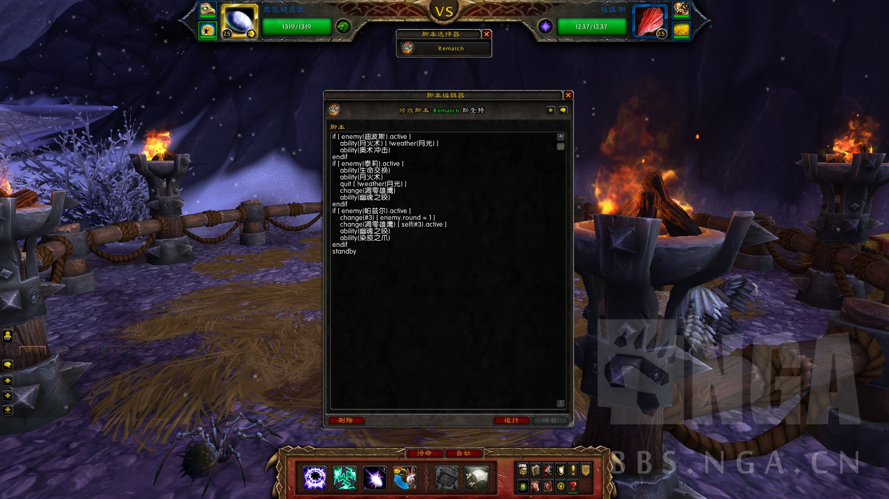
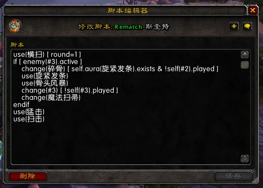

# tdBattlePetScript

This addon makes battle pet combat support scripting.

## Screenshot

## Script tutorial (Chinese only)

[Introduction](https://github.com/DengSir/tdBattlePetScript/wiki/Write-script "Introduction")

[Introduction English](https://github.com/DengSir/tdBattlePetScript/wiki/Write-script-English "Introduction English")

[API](https://github.com/DengSir/tdBattlePetScript/wiki/API "API")

[Script selector development documentation](https://github.com/DengSir/tdBattlePetScript/wiki/Script-selector "Script selector development documentation")

## Script

Example:

## Script selector

### Script selector: Base

This script selector bind the script to both teams of the current pet battle.

### Script selector: Rematch

This script selector ind the script to the Rematch team, please download [tdBattlePetScript Rematch](https://wow.curseforge.com/projects/tdbattlepetscript-rematch "tdBattlePetScript Rematch").

## Support development

[**Paypal Me**](https://www.paypal.me/dengsir "Paypal Me")

